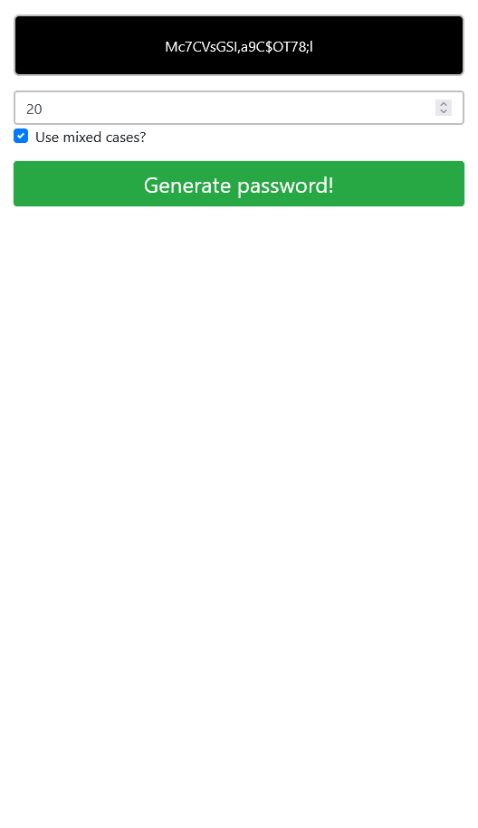

# Password-Generator-App

# Project – Password-Generator-App

Dies ist eine Lösung für eine Herausforderung bei der DCI(Digital Career Institut). Die Herausforderungen helfen Ihnen, Ihre Programmierfähigkeiten zu verbessern, indem Sie realistische Projekte erstellen.

## Inhaltsverzeichnis

- [Übersicht](#übersicht)
  - [Screenshot](#screenshot)
  - [Links](#links)
- [Mein Prozess](#mein-prozess)
  - [Erstellt mit](#erstellt-mit)
  - [Was ich gelernt habe](#was-ich-gelernt-habe)
  - [Fortsetzung der Entwicklung](#weiterentwicklung)
- [Autor](#autor)

## Überblick

### Screenshot

### Links

- Lösungs-URL: [Github-Lösungen](https://github.com/Adem-Tozlu/Project-Password-Generator)
- Live Site URL: [Website Password-Generator](https://project-password-generator-chi.vercel.app/)

## Mein Prozess

### Erstellt mit

- Semantisches HTML5-Markup
- Benutzerdefinierte CSS-Eigenschaften
- Mobile-First-Workflow
- Javascript

### Was ich gelernt habe

Im Verlauf dieses Projekts konnte ich meine Javascript-Fähigkeiten erheblich ausbauen, insbesondere habe ich gelernt, wie man HTML-Elemente über eine Javascript-Datei bearbeitet und aufruft."

### Weiterentwicklung

Ich plane, meine Javascript-Fähigkeiten in Zukunft weiter zu verbessern. Aktuell arbeite ich daran, meine Kenntnisse im Verbinden von HTML und Javascript zu vertiefen.

## Autor

- Website - [Github](https://github.com/Adem-Tozlu)
- Frontend-Mentor – [@Adem-Tozlu](https://www.frontendmentor.io/profile/Adem-Tozlu)
- Linkedin - [@Adem-Tozlu](https://www.linkedin.com/in/adem-tozlu-8906b52a5)